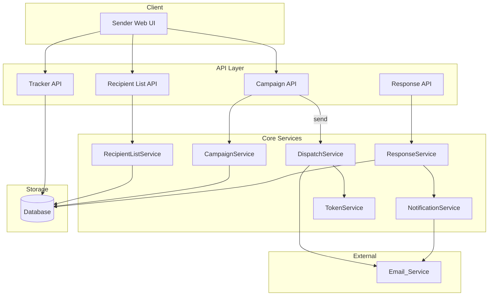

# Design Document: Email Automation

## Overview

The Email Automation feature enables a Sender to define a recipient list, configure an RSVP campaign, and automatically dispatch personalized RSVP emails. Each email contains cryptographically unique "Coming" / "Not Coming" action links. When a Recipient clicks a link, the system records the response, notifies the Sender, and updates a real-time response tracker.

The system is composed of five primary concerns:

1. Recipient list management (CRUD + CSV import + deduplication)
2. Campaign configuration and persistence
3. Email dispatch via an external Email_Service
4. Response capture via tokenized HTTP endpoints
5. Response tracking and CSV export

---

## Architecture



The API layer is a thin HTTP layer. All business logic lives in the core services. The database is the single source of truth for all state. The Email_Service is treated as an external dependency injected via an interface, making it swappable and testable.

---

## Components and Interfaces

### RecipientListService

Manages creation, modification, and validation of recipient lists.

```
createList(senderID, emails[]) → RecipientList
addRecipients(listID, emails[]) → RecipientList
removeRecipient(listID, email) → RecipientList
importFromCSV(senderID, csvBuffer) → RecipientList
validateEmail(email) → boolean
```

- Validates each email against RFC 5322 format before persisting.
- Deduplicates entries on every write operation.
- Returns structured validation errors identifying each invalid address.

### CampaignService

Handles campaign lifecycle from creation to send initiation.

```
createCampaign(senderID, name, subject, body, listID) → Campaign
getCampaign(campaignID) → Campaign
sendCampaign(campaignID) → void  // async, triggers DispatchService
```

- Enforces that name, subject, and body are non-empty before persisting.
- Enforces that the associated RecipientList is non-empty before allowing send.
- Persists creation timestamp on save.

### DispatchService

Orchestrates bulk email sending for a campaign.

```
dispatch(campaignID) → void
```

- Iterates over all recipients in the associated list.
- Calls `TokenService.generate()` per recipient to produce a Response_Token.
- Interpolates `{{name}}` placeholder in the email body.
- Calls `EmailService.send()` per recipient.
- Updates per-recipient delivery status (Pending → Sent | Failed).
- Continues delivery to remaining recipients on individual failures.
- Target: complete dispatch for ≤500 recipients within 60 seconds.

### TokenService

Generates and validates cryptographically secure response tokens.

```
generate(recipientID, campaignID) → { token: string, hash: string }
validate(rawToken) → { recipientID, campaignID } | null
expire(campaignID, cutoffDate) → void
```

- Uses a CSPRNG producing ≥128 bits of entropy (e.g., `crypto.randomBytes(32)`).
- Stores only the SHA-256 hash of the token; the raw token is embedded in the email link only.
- Tokens expire 30 days after campaign send date.

### ResponseService

Captures and persists RSVP responses.

```
recordResponse(rawToken, answer: "Coming" | "Not Coming") → RSVPResponse
getResponse(recipientID, campaignID) → RSVPResponse | null
```

- Validates the raw token via `TokenService.validate()`.
- Rejects duplicate responses (idempotent: returns existing response without overwriting).
- Triggers `NotificationService.notifySender()` after successful recording.

### NotificationService

Sends confirmation emails to the Sender.

```
notifySender(responseID) → void
```

- Sends within 30 seconds of response recording.
- Retries up to 3 times with 60-second intervals on delivery failure.
- Logs all failures.

### TrackerService / Tracker API

Provides response summary data for the dashboard.

```
getSummary(campaignID) → { total, coming, notComing, pending }
getRecipientStatuses(campaignID) → RecipientStatus[]
exportCSV(campaignID) → Buffer
```

- Dashboard reflects new responses within 5 seconds (polling or server-sent events).
- CSV export includes: email, name, response, timestamp.

### EmailService (Interface)

```
interface EmailService {
  send(to: string, subject: string, htmlBody: string): Promise<DeliveryResult>
}
```

Concrete implementations (e.g., SendGrid, SES) are injected at runtime.

---

## Data Models

### RecipientList

```
RecipientList {
  id:        UUID
  senderID:  UUID
  name:      string
  emails:    string[]   // deduplicated, validated
  createdAt: timestamp
  updatedAt: timestamp
}
```

### Campaign

```
Campaign {
  id:            UUID
  senderID:      UUID
  name:          string
  subject:       string
  body:          string          // may contain {{name}}
  listID:        UUID            // FK → RecipientList
  status:        "Draft" | "Sending" | "Sent"
  createdAt:     timestamp
  sentAt:        timestamp | null
}
```

### RecipientDelivery

```
RecipientDelivery {
  id:            UUID
  campaignID:    UUID
  email:         string
  name:          string | null
  deliveryStatus: "Pending" | "Sent" | "Failed"
  failureReason: string | null
  tokenHash:     string          // SHA-256 of Response_Token
  tokenExpiry:   timestamp
  createdAt:     timestamp
}
```

### RSVPResponse

```
RSVPResponse {
  id:          UUID
  campaignID:  UUID
  email:       string
  answer:      "Coming" | "Not Coming"
  respondedAt: timestamp
}
```

### NotificationLog

```
NotificationLog {
  id:          UUID
  responseID:  UUID
  attempts:    number
  lastAttempt: timestamp
  status:      "Pending" | "Delivered" | "Failed"
}
```

---

## Correctness Properties

*A property is a characteristic or behavior that should hold true across all valid executions of a system — essentially, a formal statement about what the system should do. Properties serve as the bridge between human-readable specifications and machine-verifiable correctness guarantees.*

### Property 1: Email validation rejects malformed addresses with identification

*For any* string that is not a valid RFC 5322 email address, the validation function should reject it and the returned error should identify the specific invalid address.

**Validates: Requirements 1.2, 1.3**

---

### Property 2: Recipient list deduplication is idempotent

*For any* recipient list and any email address already present in that list, adding the same address again should leave the list size unchanged and contain exactly one entry for that address.

**Validates: Requirements 1.6**

---

### Property 3: Add then remove is a round trip

*For any* recipient list and any valid email address not already in the list, adding then removing that address should produce a list equal to the original.

**Validates: Requirements 1.4**

---

### Property 4: CSV import preserves valid emails

*For any* CSV buffer containing rows with valid email addresses, importing it should produce a recipient list whose email set equals the set of valid emails found in the CSV (after deduplication).

**Validates: Requirements 1.5**

---

### Property 5: Campaign creation rejects missing required fields

*For any* campaign creation attempt where at least one of name, subject, or body is empty or absent, the system should reject the request and not persist a campaign.

**Validates: Requirements 2.1**

---

### Property 6: Campaign send is blocked for empty recipient lists

*For any* campaign associated with an empty recipient list, initiating send should be rejected before any emails are dispatched.

**Validates: Requirements 2.2**

---

### Property 7: Name placeholder interpolation never leaks the literal token

*For any* email body containing the `{{name}}` placeholder and any recipient, the rendered email body should either contain the recipient's name (when available) or contain no occurrence of the literal string `{{name}}` (when name is absent).

**Validates: Requirements 2.3**

---

### Property 8: Campaign persistence round trip

*For any* campaign with valid fields, saving then retrieving it should return a campaign with identical name, subject, body, list ID, and a non-null creation timestamp.

**Validates: Requirements 2.4**

---

### Property 9: Dispatch sends to every recipient and assigns a status

*For any* campaign with N recipients, after dispatch completes, exactly N send attempts should have been made and every recipient should have a delivery status of Sent or Failed (none remain Pending).

**Validates: Requirements 3.1, 3.6**

---

### Property 10: Tokens are unique per recipient per campaign

*For any* campaign with N recipients, the N generated Response_Tokens should all be distinct.

**Validates: Requirements 3.2**

---

### Property 11: Both action links embed the token

*For any* generated RSVP email, both the "Coming" link and the "Not Coming" link should contain the recipient's Response_Token as a URL parameter.

**Validates: Requirements 3.3**

---

### Property 12: Delivery failure is isolated

*For any* campaign where a subset of Email_Service calls return failure, the failed recipients should be marked "Failed" with a recorded reason, and all other recipients should still receive their emails (i.e., failures do not halt the dispatch loop).

**Validates: Requirements 3.5**

---

### Property 13: Response recording round trip

*For any* valid Response_Token and any answer value ("Coming" or "Not Coming"), recording the response and then retrieving it should return the same answer associated with the correct recipient and campaign.

**Validates: Requirements 4.1, 4.2, 4.3**

---

### Property 14: Invalid tokens are rejected

*For any* string that is not a valid, unexpired Response_Token, the response capture endpoint should return an error result and not record any RSVP response.

**Validates: Requirements 4.4**

---

### Property 15: Response submission is idempotent

*For any* recipient who has already submitted an RSVP response for a campaign, submitting any response again (same or different answer) should leave the stored response unchanged.

**Validates: Requirements 4.5, 7.3**

---

### Property 16: Confirmation email contains all required fields

*For any* recorded RSVP response, the rendered Confirmation_Email body should contain the recipient's email address, the answer ("Coming" or "Not Coming"), the campaign name, and the response timestamp.

**Validates: Requirements 5.2**

---

### Property 17: Notification is triggered for every recorded response

*For any* successfully recorded RSVP response, the NotificationService should be invoked exactly once with that response's ID.

**Validates: Requirements 5.1**

---

### Property 18: Notification retry does not exceed three attempts

*For any* notification delivery that fails, the system should retry at most 3 times and log each failure; it should not attempt a 4th delivery.

**Validates: Requirements 5.3**

---

### Property 19: Tracker covers all recipients

*For any* campaign, the tracker's recipient status list should contain exactly one entry per recipient in the associated list, with no omissions.

**Validates: Requirements 6.1**

---

### Property 20: Aggregate counts are consistent

*For any* campaign, the sum of "Coming" count + "Not Coming" count + "Pending" count should equal the total recipient count returned by the tracker.

**Validates: Requirements 6.2**

---

### Property 21: Tracker reflects new responses

*For any* campaign, after an RSVP response is recorded, querying the tracker should return the updated status for that recipient (not the previous Pending status).

**Validates: Requirements 6.3**

---

### Property 22: CSV export contains all required columns for every recipient

*For any* campaign, the exported CSV should contain exactly one row per recipient, and each row should include the recipient's email, name (or empty), RSVP response (or empty if pending), and response timestamp (or empty if pending).

**Validates: Requirements 6.4**

---

### Property 23: Token generation meets entropy and storage requirements

*For any* generated Response_Token, the raw token should be at least 16 bytes (128 bits) long, and the value stored in the database should be the SHA-256 hash of the raw token (not the raw token itself).

**Validates: Requirements 7.1, 7.2**

---

### Property 24: Expired tokens are rejected

*For any* Response_Token whose campaign send date is more than 30 days in the past, the token validation function should return invalid regardless of whether the token was previously unused.

**Validates: Requirements 7.4**

---

## Error Handling

| Scenario | Behavior |
|---|---|
| Malformed email in recipient list | Reject entry; return error identifying the bad address; do not persist |
| Empty campaign fields | Reject campaign creation with field-level validation errors |
| Campaign send with empty list | Reject send; return descriptive error |
| Email_Service delivery failure | Mark recipient as Failed; record reason; continue dispatch |
| Invalid/expired Response_Token | Return HTTP 400/410 error page; do not record response |
| Duplicate response submission | Return "already recorded" message; do not overwrite original |
| Confirmation email delivery failure | Log failure; retry up to 3 times at 60-second intervals |
| CSV import with mixed valid/invalid rows | Import valid rows; return list of skipped rows with reasons |

All service-layer errors are typed (not generic exceptions) so callers can pattern-match on error kind. HTTP endpoints translate service errors to appropriate status codes (400 for validation, 404 for not found, 410 for expired tokens, 500 for unexpected failures).

---

## Testing Strategy

### Dual Testing Approach

Both unit tests and property-based tests are required. They are complementary:

- Unit tests cover specific examples, integration points, and edge cases.
- Property tests verify universal correctness across randomized inputs.

### Property-Based Testing

**Library**: [fast-check](https://github.com/dubzzz/fast-check) (TypeScript/JavaScript) or [hypothesis](https://hypothesis.readthedocs.io/) (Python), depending on the implementation language.

Each property test must:
- Run a minimum of **100 iterations**.
- Be tagged with a comment in the format:
  `// Feature: email-automation, Property N: <property_text>`
- Map 1:1 to a property defined in the Correctness Properties section above.

**Generators needed**:
- `arbitraryEmail()` — valid RFC 5322 email strings
- `arbitraryMalformedEmail()` — strings that look like emails but are invalid
- `arbitraryCampaign()` — campaigns with random valid fields
- `arbitraryRecipientList(n)` — lists of n valid emails
- `arbitraryCSVBuffer()` — CSV buffers with mixed valid/invalid rows
- `arbitraryToken()` — random byte strings (for invalid token testing)
- `arbitraryAnswer()` — one of "Coming" | "Not Coming"

**Property tests to implement** (one test per property):

| Test | Property | Key generator |
|---|---|---|
| Email validation rejects malformed | Property 1 | `arbitraryMalformedEmail` |
| Deduplication idempotence | Property 2 | `arbitraryRecipientList` |
| Add/remove round trip | Property 3 | `arbitraryRecipientList`, `arbitraryEmail` |
| CSV import preserves emails | Property 4 | `arbitraryCSVBuffer` |
| Campaign rejects missing fields | Property 5 | partial campaign objects |
| Empty list blocks send | Property 6 | `arbitraryCampaign` with empty list |
| Name placeholder never leaks | Property 7 | body strings, optional names |
| Campaign persistence round trip | Property 8 | `arbitraryCampaign` |
| Dispatch covers all recipients | Property 9 | `arbitraryCampaign`, mock EmailService |
| Tokens are unique | Property 10 | `arbitraryRecipientList` |
| Both links embed token | Property 11 | token + email template |
| Failure isolation | Property 12 | mock EmailService with random failures |
| Response round trip | Property 13 | `arbitraryToken`, `arbitraryAnswer` |
| Invalid tokens rejected | Property 14 | `arbitraryToken` |
| Response idempotence | Property 15 | valid token + two answer submissions |
| Confirmation email fields | Property 16 | `arbitraryAnswer`, campaign, recipient |
| Notification triggered once | Property 17 | mock NotificationService |
| Retry cap at 3 | Property 18 | mock EmailService always failing |
| Tracker covers all recipients | Property 19 | `arbitraryCampaign` |
| Aggregate counts consistent | Property 20 | campaigns with mixed responses |
| Tracker reflects new responses | Property 21 | response recording + tracker query |
| CSV export columns complete | Property 22 | campaigns with mixed response states |
| Token entropy and storage | Property 23 | generated tokens |
| Expired tokens rejected | Property 24 | tokens with manipulated timestamps |

### Unit Tests

Focus on:
- Specific examples: a known valid email, a known invalid email, a known CSV fixture.
- Integration between DispatchService → TokenService → EmailService (using test doubles).
- HTTP endpoint response codes (400, 404, 410, 500) for each error scenario in the Error Handling table.
- The confirmation page rendered to a recipient after a successful response (Requirement 4.6).
- Edge cases: empty CSV, CSV with only headers, recipient list with exactly one address.

### Test Organization

```
tests/
  unit/
    recipientList.test.ts
    campaign.test.ts
    dispatch.test.ts
    response.test.ts
    notification.test.ts
    tracker.test.ts
    token.test.ts
  property/
    recipientList.property.test.ts
    campaign.property.test.ts
    dispatch.property.test.ts
    response.property.test.ts
    notification.property.test.ts
    tracker.property.test.ts
    token.property.test.ts
```
